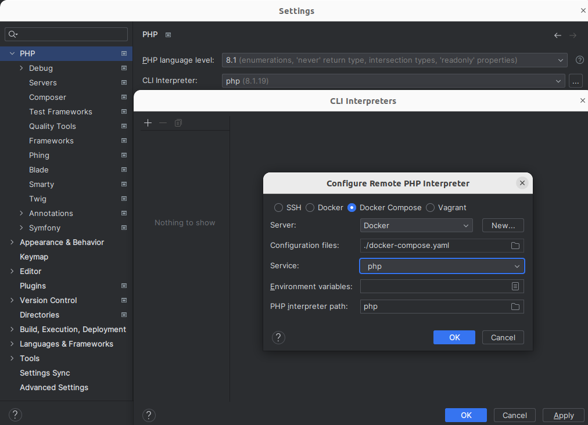

# Symfony Project

It is simple project that prove Symfony skill and stack around Symfony such as docker encore etc.

## Prerequisite

- docker
- docker-compose
- make (optional but make life easier)

## How to start

If u have installed make you can simply run project by init command using make

```shell
make init
```

If not just run the following set of commands

```shell
docker-compose up -d
docker-compose exec php composer install
docker-compose exec php bin/console doctrine:database:create --no-interaction --if-not-exists
docker-compose exec php bin/console doctrine:migrations:migrate --no-interaction --allow-no-migration
docker-compose exec php bin/console doctrine:fixture:load --append
```

After project is once initialized we can run it by start make command

```shell
make start
```

or by docker-comppose

```shell
docker-compose up -d
```

## Debugger configuration

At first, we need to configure CLI interpreter in your PHPStorm IDE


Then will be needed to set server settings for X-debug path mapping


And that's all now X-debug should work